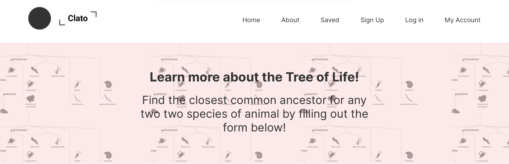

# Clato
## Description
Clato is a site designed to explore common ansestory between species by being able to see the divergence between creatures through time provides an exciting and stimulating way to make scientific abstractions tangible & real. Our goal is to bridge the gap between scientific research available to the public on biology & taxonomy and intellectually curious members of the public who want to understand more about current scientific models for Life on Earth. Specifically, we want to create a visual index for the relationship between different creatures and how they play into frameworks that attempt to explain the history of life on our planet.

## Link to Website
https://clato.herokuapp.com/
## Target Browsers
* iPhone X/11/12 
* Macbook 13/15 
* Google Chrome/Apple Safari
## Links
* [Developer Manual](https://github.com/inst377-group3/Final-Project-Base/blob/main/README.md#developer-manual)

# Developer Manual
## How to install application and all dependencies
1. Clone this repository through Github Desktop or through Terminal.
2. Open repository in VSCode Terminal or Terminal application.
3. Type `npm install` into terminal window and run.
## How to run application on a server
1. Open repository in VSCode terminal or Terminal application.
2. Run `npm start`. There should be no errors.
3. In a web browser, go to url: http://localhost:3000/.
## Server application APIs

** NOTE: Species are primary indexed by taxon ID(GBIF).
##### STILL NEEDS WORK

# Known Bugs and Future Development
### Bugs: 
* 
### Future Development:
* Increase data avilable in the database
* Improvement on Tree Visualizations 
