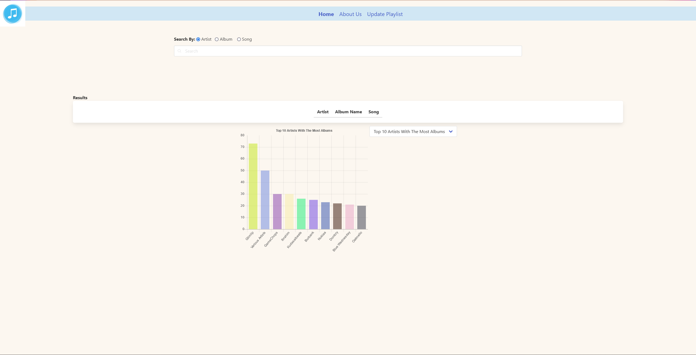

# Songify

## Project Description
This app allows users to edit songs, artists, albums, and genres to their playlist. By creating a Username and playlist name, this app keeps track of when a song is added or deleted to the database and by whom. It also displays relevant data such as top 10 longest songs, top 10 largest albums, and top 10 artists with the most albums. Finally we have also implimented a search bar that allows you to search by song name, artist, or album name.


## Link
https://inst377group15.herokuapp.com/

## Target Browsers
The target brower for this application would be iOS. Specifically it can be used on browers such as Google Chrome or Safari. It can be accessed through the web or on a mobile device to allow for users to interact with the application easily. 
## Endpoint Doc 
### Server application APIs
```/artists``` - API route for artist data.
* GET - Logs to console response query from URL. returns a promise object
* POST - Obtains artist name from request body to fetch url. Fetch data from req.body and returns JSON response to artists table
* DELETE - Obtains artist name from request body to fetch url. fetch data req.body and deletes item from artists table and returns JSON response

```/genres``` - API route for genres data.
* GET - Logs to console response query from URL. returns a promise object
* POST - Obtains genre name from request body to fetch url. Fetch data from req.body and returns JSON response to genres table
* DELETE - Obtains genre name from request body to fetch url. fetch data req.body and deletes item from genres table and returns JSON response

```/playlists``` - API route for playlists data.
* GET - Logs to console response query (username and playlist name) from URL. returns a promise object
* POST - Obtains playlist name from request body to fetch url. Fetch data from req.body and returns JSON response to playlists table
* DELETE - Obtains playlist name from request body to fetch url. fetch data req.body and deletes item from playlists table and returns JSON response

```/albums``` - API route for albums data.
* GET - Logs to console response query from URL. returns a promise object
* POST - Obtains album name from request body to fetch url. Fetch data from req.body and returns JSON response to albums table
* DELETE - Obtains albums name from request body to fetch url. fetch data req.body and deletes item from albums table and returns JSON response

```/songs``` - API route for songs data.
* GET - Logs to console response query from URL. returns a promise object
* POST - Obtains song name from request body to fetch url. Fetch data from req.body and returns JSON response to songs table
* DELETE - Obtains song name from request body to fetch url. fetch data req.body and deletes item from songs table and returns JSON response

```/artist_albums``` - API route for artist_albums data.
* GET - Logs to console response query from URL. returns a promise object
* POST - Sets artist_albums linking table ids to the new ids from the added values of albums post and artist post
* DELETE - Obtains artist name from request body to fetch url. fetch data req.body and deletes item from artist_albums table and returns JSON response

```/album_songs``` - API route for album songs data.
* GET - Logs to console response query from URL. returns a promise object
* POST - Sets album_songs linking table ids to the new ids from the added values of albums post and songs post
* DELETE - Obtains artist name from request body to fetch url. fetch data req.body and deletes item from album_songs table and returns JSON response

```/artist_songs``` - API route for artist ssongs data.
* GET - Logs to console response query from URL. returns a promise object
* POST - Sets artist_songs linking table ids to the new ids from the added values of artists post and songs post
* DELETE - Obtains artist name from request body to fetch url. fetch data req.body and deletes item from artist_songs table and returns JSON response

```/song_genres``` - API route for song genres data.
* GET - Logs to console response query from URL. returns a promise object
* POST - Sets song_genre linking table ids to the new ids from the added values of genres post and songs post
* DELETE - Obtains artist name from request body to fetch url. fetch data req.body and deletes item from song_genres table and returns JSON response

```/playlist_songs``` - API route for playlist songs data.
* GET - Logs to console response query from URL. returns a promise object
* POST - Obtains username and playlist name from request body to fetch url. Fetch data from req.body and returns JSON response to playlist_songs table
* DELETE - Obtains artist name from request body to fetch url. fetch data req.body and deletes item from playlist_songs table and returns JSON response

## Known bugs
* DELETE request was never finished
* Add request sometimes doesn't incriment the ids

## Work for the future
* Add a search via Genre option in the search menu
* Add more options for the graph
* Add a feature that pics a random song for you

## Developer Manual
# How to install application and all dependencies
1. Clone this repository through Github Desktop or through Terminal.
2. Open repository in VSCode Terminal or Terminal application.
3. type ```npm install``` into terminal window and run.
4. The application should now be set to use.
# How to run the application on a server
1. Open a repository in VSCode terminal or Terminal application
2. Run ```npm start```.
3. In a web browser, type in ```http://localhost:3000/```
# To test software
Since we did not write any tests in the source repository, you can use Cypress to run your own tests.
1. Open two terminals and make sure that you are in the mai project directory
2. In the first terminal, run ```npm start```.
3. In the second terminal run ```npm test```.

